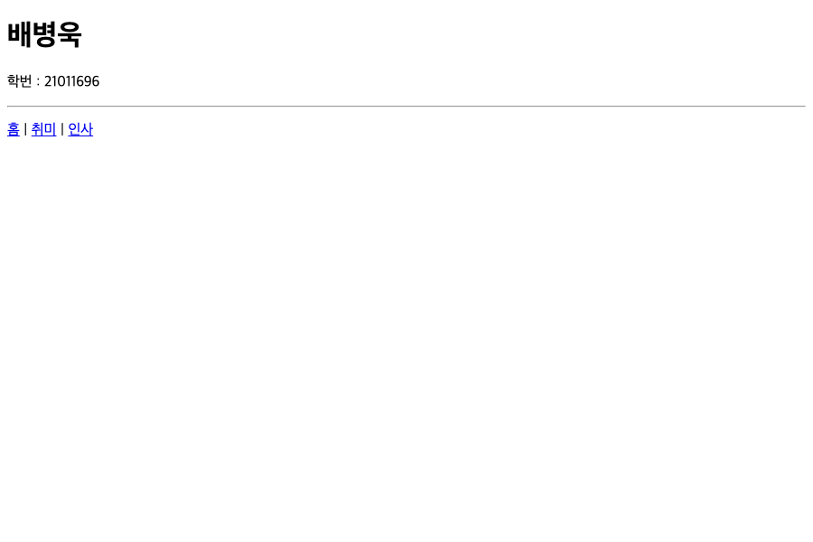
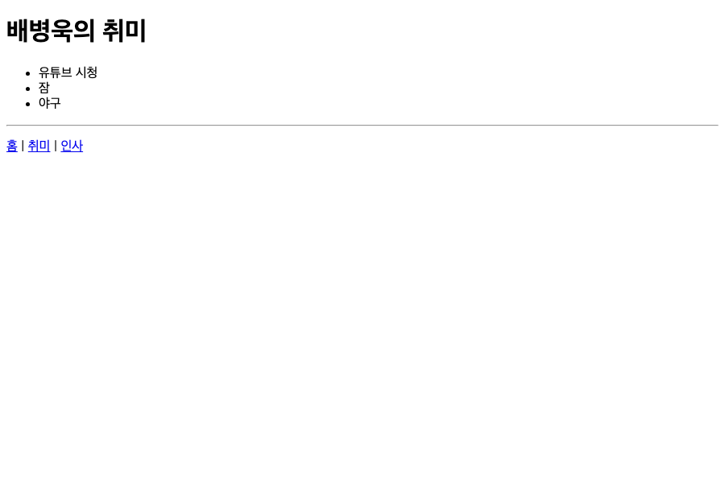

# HW1 — 나를 소개하는 미니 사이트

- 이름 : 배병욱
- 학번 : 21011696

## 만든 페이지

| 주소 | 내용 |
|---|---|
| `/` | 내 이름과 학번 |
| `/profile` | 취미 3가지를 목록으로 |
| `/greet/<name>` | "안녕하세요, OOO님" |

세 페이지 모두 `templates` 폴더의 html 파일을 `render_template` 으로 불러옵니다.
취미는 `app.py` 의 파이썬 리스트를 넘겨 템플릿에서 `` 로 출력합니다.

## 실행 방법

```
cd HW1
flask run
```

## 실행 화면

### `/`


### `/profile`


### `/greet/배병욱`

