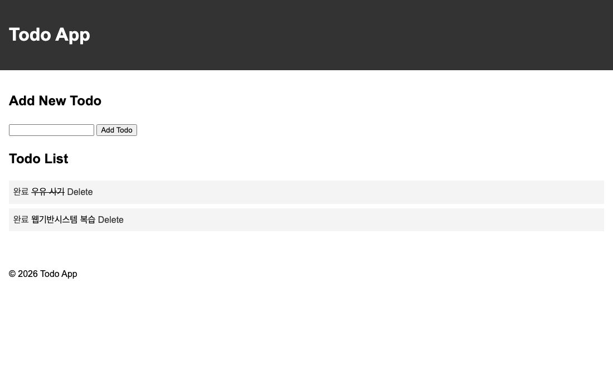

# HW2 — Todo 앱에 완료 체크 기능 추가

- 이름 : 배병욱
- 학번 : 21011696

Note 5의 Todo 앱을 `todo_app`에 작성하고, `HW2`로 복사한 뒤 완료 체크 기능을 추가했습니다.

## 수정한 부분

1. 할 일을 문자열 대신 `{'text': todo, 'done': False}` 형태로 저장했습니다.
2. `/toggle/<int:index>`에서 `done` 값을 반대로 바꾸고 목록으로 돌아가도록 했습니다. 없는 번호로 접근하면 목록으로 돌아갑니다.
3. 목록에는 `todo.text`를 출력하고, 각 항목 앞에 `완료` 링크를 추가했습니다.
4. 완료한 항목에 `done` 클래스를 붙여 글자에 취소선이 나오도록 했습니다.

`완료`를 다시 누르면 취소선이 사라집니다. 기존 추가와 Delete 기능은 그대로입니다.
새로고침해도 완료 상태가 유지되지만, 서버를 껐다 켜면 목록이 사라집니다.

## 실행 방법

저장소 맨 위에서 기존 가상환경을 활성화한 뒤 실행합니다.

```bash
source venv/bin/activate
cd HW2
flask --debug run
```

브라우저에서 http://127.0.0.1:5000/ 에 접속합니다.

## 동작 확인

- 할 일 두 개를 추가하면 순서대로 표시됩니다.
- 첫 번째 항목의 `완료`를 누르면 해당 글자에만 취소선이 생깁니다.
- 새로고침해도 항목이 중복되지 않고 취소선이 유지됩니다.
- `완료`를 한 번 더 누르면 취소선이 사라집니다.
- Delete로 삭제한 뒤 남은 항목도 완료와 취소가 됩니다.
- `/toggle/99`처럼 없는 번호로 접근해도 오류 없이 목록으로 돌아갑니다.

## 실행 화면

### ① 할 일 두 개가 있는 목록


### ② 하나를 완료한 화면

첫 번째 항목인 우유 사기에 취소선이 생겼습니다.



### ③ 새로고침한 뒤의 화면

새로고침한 뒤에도 우유 사기의 취소선이 그대로 남아 있습니다.


